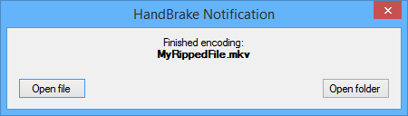

HandBrakeNotification
=====================
Notification tool for [HandBrake](https://github.com/HandBrake/HandBrake)

Usage
-----
1. Place *HandBrakeNotification.exe* and an optional *sound.wav* in a folder of your choice (e.g. *HandBrake/Notification*)
2. Start HandBrake and navigate to *Tools > Options > General*
3. Under "When Done" tick "Send file to:" and choose *HandBrakeNotification.exe*